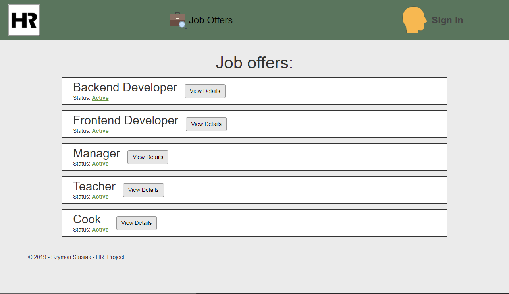

# HR Project

Simple WEB application dedicated for HR deparment of a company to manage job offers and browse sent applications.

Project created for classes on Warsaw University of Technology (_Creating Web Applications with .NET Framework_).

## Technology
* __.NET Core 2.1__ - main technology used for development 
* __Entity Framework__ - used to apply code-first approach
* __MSSQL Server__ - browsing and managing data in database
* __Razor__ (with  __AJAX__ and __knockout__) - frontend
* __Nunit__ - unit tests

## External integrations
* __Azure Blob Storage__ - cloud containers used for storing candidates' CVs
* __Sendgrid__ - email notifications for HR manager after sending new applications
* __Azure AD B2C__ - authentication
* __Swagger__ - documentation
* __Azure pipelines__ - continuous integration for Azure DevOps